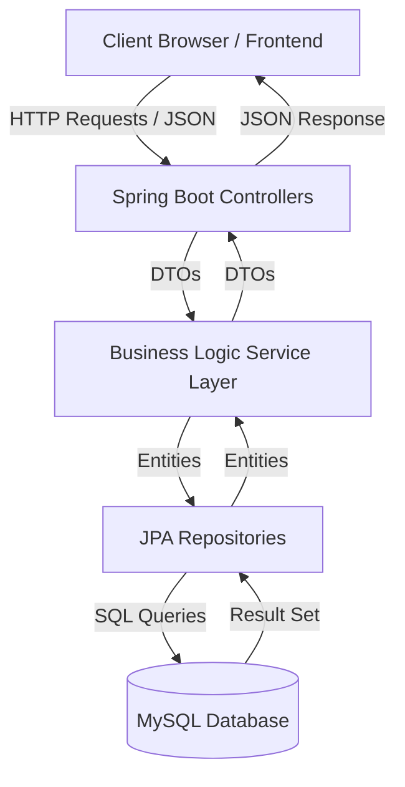

# EatEasy - Project Report

## 1. Project Overview
**EatEasy** is a comprehensive multi-vendor food delivery application designed to connect customers with local restaurants. The system comprises three main modules:
-   **Customer Module**: For browsing restaurants, viewing menus, placing orders, and tracking deliveries.
-   **Restaurant Owner Module**: For managing restaurant details, menus, orders, and viewing analytics.
-   **Admin Module**: For platform oversight, managing users, restaurants, and viewing platform-wide analytics.

---

## 2. Technology Stack
### Frontend
-   **Framework**: Angular (Latest Version)
-   **Styling**: CSS3, Responsive Design
-   **Architecture**: Modular (Core, Shared, Features)

### Backend
-   **Framework**: Spring Boot (Java)
-   **Security**: Spring Security with JWT Authentication
-   **Database Access**: Spring Data JPA / Hibernate

### Database
-   **Database**: MySQL
-   **Management**: Hibernate ORM (Auto-DDL)

---

## 3. System Architecture & Data Flow

### Data Flow Diagram
The following diagram illustrates the data flow from the user interface through the backend layers to the database.



### Flow Description
1.  **User Action**: The user interacts with the Angular Frontend (e.g., placing an order).
2.  **API Call**: The frontend sends an HTTP request (POST/GET) to the Backend API.
3.  **Controller Layer**: Receives the request, validates input, and delegates to the Service Layer.
4.  **Service Layer**: Executes business logic (e.g., calculating totals, verifying stock).
5.  **Repository Layer**: Interacts with the MySQL database using JPA/Hibernate to save or fetch data.
6.  **Response**: Data flows back up the chain and is returned to the Frontend as a JSON response.

---

## 4. User Credentials (For Testing)
The following credentials have been pre-seeded into the database for testing purposes.

### Admin
| Role | Email | Password |
| :--- | :--- | :--- |
| **Admin** | `admin@eateasy.com` | `admin123` |

### Customer
| Role | Email | Password |
| :--- | :--- | :--- |
| **Customer** | `user@eateasy.com` | `user123` |

### Restaurant Owners
| Restaurant Name | Owner Email | Password |
| :--- | :--- | :--- |
| **Chettinad Spice** | `owner1@eateasy.com` | `owner1` |
| **Spice Haven** | `owner2@eateasy.com` | `owner2` |
| **Italiano Delight** | `owner3@eateasy.com` | `owner3` |
| **Dragon Wok** | `owner4@eateasy.com` | `owner4` |
| **Tandoori Flames** | `owner5@eateasy.com` | `owner5` |
| **KFC** | `owner6@eateasy.com` | `owner6` |
| **SS Hyderabad Biryani** | `owner7@eateasy.com` | `owner7` |
| **Dindigul Thalappakatti** | `owner8@eateasy.com` | `owner8` |
| **Hotel Saravana Bhavan** | `owner9@eateasy.com` | `owner9` |
| **Domino's Pizza** | `owner10@eateasy.com` | `owner10` |
| **Adyar Ananda Bhavan** | `owner11@eateasy.com` | `owner11` |

---

## 5. Frontend Architecture
The frontend is built with Angular and structured into feature modules.

### Core Structure (`src/app`)
-   **Core Module**: Singleton services, guards, and interceptors.
-   **Shared Module**: Reusable components and pipes.

### Feature Modules (`src/app/features`)

#### **Auth Module** (`features/auth`)
-   **Login Component**: Handles user authentication.
-   **Register Component**: Handles new user registration (Customer/Restaurant Owner).

#### **Admin Module** (`features/admin`)
-   **Dashboard**: Overview of platform metrics.
-   **Analytics**: Detailed charts and reports.
-   **User Management**: View and manage system users.
-   **Restaurant Management**: Approve/Block restaurants.
-   **Coupon Management**: Create and manage promotional coupons.

#### **Customer Module** (`features/customer`)
-   **Home**: Landing page with featured restaurants and categories.
-   **Restaurant List**: Browse and filter restaurants.
-   **Restaurant Detail**: View menu items and add to cart.
-   **Cart**: Manage selected items.
-   **Checkout**: Finalize order and payment.
-   **Order History**: View past orders.
-   **Order Tracking**: Real-time status of active orders.

#### **Restaurant Module** (`features/restaurant`)
-   **Dashboard**: Daily sales and order summary.
-   **Restaurant Profile**: Manage restaurant details (images, hours).
-   **Menu Management**: Add, edit, or delete categories and items.
-   **Orders**: Manage incoming and ongoing orders.
-   **Analytics**: Sales performance reports.

---

## 6. Backend Architecture
The backend is a Spring Boot application structured into strictly defined layers.

### Controllers (API Layer)
Handles incoming HTTP requests.
-   `AuthController`: Login and Registration endpoints.
-   `AdminController`: Administrative actions.
-   `UserController`: User profile management.
-   `RestaurantController`: Restaurant CRUD and search operations.
-   `MenuCategoryController` & `MenuItemController`: Menu management.
-   `OrderController` & `OrderItemController`: Order processing.
-   `ReviewController`: Customer reviews and ratings.
-   `AnalyticsController`: Data aggregation for dashboards.

### Services (Business Logic)
Contains the core business rules.
-   `AuthService`, `UserService`, `RestaurantService`
-   `MenuCategoryService`, `MenuItemService`
-   `OrderService`, `OrderItemService`, `ReviewService`

### Data Models (Entities)
Maps to database tables.
-   `User` (Roles: ADMIN, CUSTOMER, RESTAURANT_OWNER)
-   `Restaurant` (Linked to Owner)
-   `MenuCategory` & `MenuItem` (Menu structure)
-   `Order` & `OrderItem` (Transaction data)
-   `Cart` & `CartItem` (Temporary shopping data)
-   `Review` (Ratings)
-   `Coupon` (Discounts)

### Repositories (Data Access)
Interfaces extending `JpaRepository` for DB interactions.
-   `UserRepository`, `RestaurantRepository`, `OrderRepository`, etc.

---

## 7. Database Configuration
The application uses MySQL. Below is the configuration from `application.properties`.

```properties
# Server Configuration
server.port=8080
spring.application.name=backend

# Database Connection
spring.datasource.url=jdbc:mysql://localhost:3306/eat_easy_db?useSSL=false&allowPublicKeyRetrieval=true&serverTimezone=UTC&createDatabaseIfNotExist=true
spring.datasource.username=root
spring.datasource.password=17072001

# JPA / Hibernate Configuration
spring.jpa.hibernate.ddl-auto=update
spring.jpa.show-sql=true
spring.jpa.properties.hibernate.dialect=org.hibernate.dialect.MySQLDialect

# Security (JWT)
jwt.secret=MySuperSecretKeyForEatEasyApp12345678901234567890
jwt.expiration-ms=86400000
```

---

## 8. Development Setup
1.  **Database**: Ensure MySQL is running on port 3306. Create schema `eat_easy_db` (or let Hibernate create it).
2.  **Backend**: Run the Spring Boot application. It will maximize existing roles and seed initial data via `DataSeeder.java`.
3.  **Frontend**: Run `ng serve` to start the Angular development server on port 4200.
